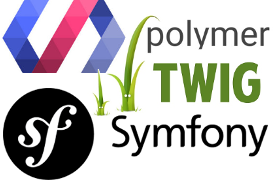

# Polyphonic Polymer Bundle

Symfony bundle and Twig extension for developing and deploying Polymer web components.

[](https://travis-ci.org/headzoo/polymer-bundle)
[](https://raw.githubusercontent.com/headzoo/polymer-bundle/master/LICENSE.md)



**This bundle is no where near production ready. It's not even dev ready. Use at your own risk.**

The purpose of this bundle is making it easier to use and build Polymer web components within a Symfony project.
Polyphonic handles the problems that come up when trying to build and use web components within Twig templates.

## Quick Start
A simple example of using the `` Twig tag to create a custom `<hello-world><hello-world>` element.
This element displays "Hello, World!" by default, but the message can be changed by setting the `name` attribute.

Note that there's no need to add `<link rel="import" href="polymer/polymer.html">` as the import statement is added
automatically. The template is saved in the bundle directory at
`Resources/public/elements/hello-world/hello-world.html.twig`.

```html

    <template>
        <p>Hello, {{name}}!</p>
    </template>
    <script>
        Polymer({
            name: "World"
        });
    </script>

```

Using the element in your views:

```html


<!-- Displays "Hello, World!" -->
<hello-world></hello-world>

<!-- Displays "Hello, Pascal!" -->
<hello-world name="Pascal"></hello-world>
```

Note, the import statement can also be written like this:

```html

```

Polyphonic assumes a file named `hello-world.html.twig` can be found in a directory of the same name, e.g. `hello-world`.
